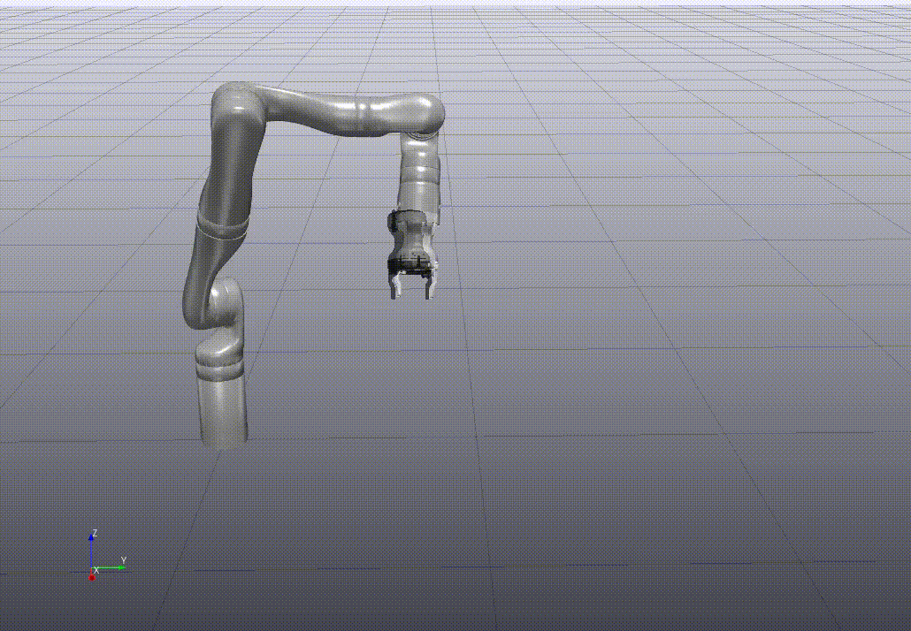
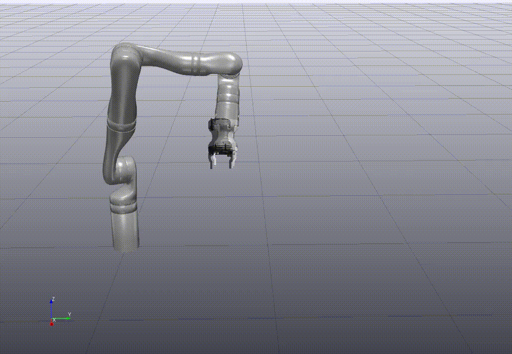

# Passivity-Based Manipulator Control with Guaranteed Singularity Avoidance

This repository contains code for demonstrating a new approach to passivity-based control (PBC) of robot manipulators, which can guarantee both passivity and constraint satisfaction. We focus in particular on designing control barrier functions to avoid kinematic singularities. 

**Run the online interactive version on [Google Colab here](https://colab.research.google.com/github/vincekurtz/passivity_cbf_demo/blob/master/colab.ipynb)**

| |          | 
|:----------------------------:|:---------------------:|
| *Standard Constrained PBC*   | *Proposed Approach* |

## Dependencies

To run this code locally, you will need

- python3
- [Drake](https://drake.mit.edu/), compiled with python bindings
- numpy
- matplotlib
- tkinter

An example of setting up a virtualenv:

```
python -m venv .venv/
source .venv/bin/activate
pip install drake jupyterlab ipywidgets matplotlib tk
```

## Usage

Clone this repository: `git clone https://github.com/vincekurtz/passivity_cbf_demo/`

Start the visualizer using the appropriate env:
```
python -m pydrake.visualization.meldis
```

Run the main script: `./simulate.py`

Additional options (different control schemes, plotting, etc) can be set in the "Setup Parameters" section of `simulate.py`.
